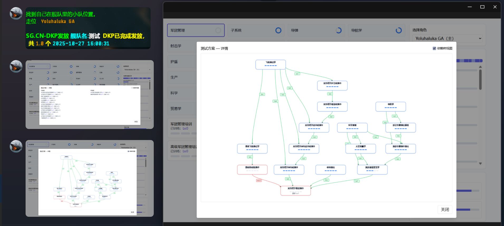

# 2025-10

---

- 繁忙的一个月，几乎没休息日
- 让我瞅瞅这个blog能更多久

## 10-27

- 奶龙觉得社团wiki在push前merge导致commit记录太多了，改成用rebase，又去恶补了git，最后决定分支直接push上去，在pr时统一merge
- 不想写计组实验报告，因为还有的拖哈哈哈哈，下周就三休了，周一没课
- eve那边的项目最近没兴趣去做，但是上周答应了一周把招新机器人那块做完，也不难做就是麻烦，星总今天还给我发了几个sgcn的网站图，前端狗都不做
    
- 微软365的icon好像更新了，又丑又好看的