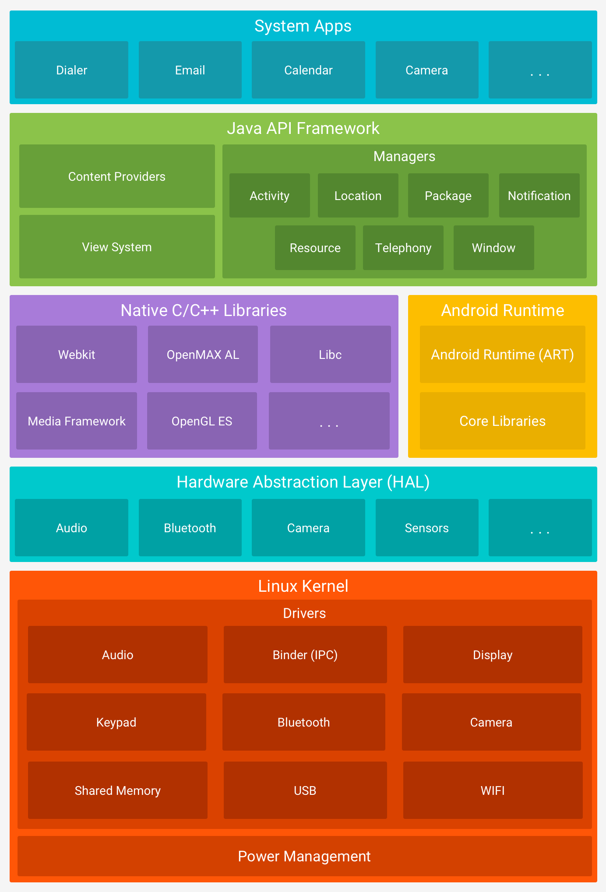

# Android 基础知识

本文档收集一些理论性知识，较为零碎，但是最终编织成一张大网。

最后更新与 2025-10-29 by N0rth5ea in CAUC

---

{width="500"}
/// caption
放上谷歌官方的 Android 分层架构图镇楼
///

## Android 启动流程
??? quote "参考资料"
    - [Android启动系列之一：init进程和Zygote进程](https://cloud.tencent.com/developer/article/2415718){target="_blank" rel="noopener"}

!!! note "相关链接"
    - [Zygote](#zygote)
    - [System Server](#system_server)

1. 【启动电源及系统启动】 
    当电源按下时引导芯片代码从预定义的地方（固化在 ROM）开始执行。加载引导程序 Bootloader 到 RAM 中，然后执行。
2. 【引导程序 BootLoader】 
    引导程序 BootLoader 把系统 OS 拉起来并运行。
3. 【Linux 内核启动】 
    当内核启动时，设置缓存、加载驱动等。在内核完成系统设置后，首先在系统文件中寻找 init.rc 文件，并启动 init 进程。
4. 【init 进程启动】 
    init 进程主要用来初始化和启动属性服务，也用来启动 Zygote 进程。
5. 【Zygote 进程启动】 
    Zygote 进程会孵化系统服务 System Server 进程。

## Zygote

??? quote "参考资料"
    - [Zygote 进程简介](https://source.android.google.cn/docs/core/runtime/zygote?hl=zh-cn){target="_blank" rel="noopener"}
    - [谈谈对Android中Zygote的理解](https://zhuanlan.zhihu.com/p/260414370){target="_blank" rel="noopener"}
    - [Android启动系列之一：init进程和Zygote进程](https://cloud.tencent.com/developer/article/2415718){target="_blank" rel="noopener"}
    - [Android 9.0.0_r45 源码分析](https://github.com/lulululbj/android_9.0.0_r45/tree/master){target="_blank" rel="noopener"}

!!! note "相关链接"
    - [Android 启动流程](#android_1)
   - [Xposed](#xposed)
    - [System Server](#system_server)

Zygote 翻译为“受精卵”，在 Android 系统中负责创建新的应用进程。[官方文档](https://source.android.google.cn/docs/core/runtime/zygote?hl=zh-cn){target="_blank" rel="noopener"}

为什么存在 Zygote 进程？

- 为了提高应用启动速度，Zygote 进程在系统启动时就会创建，它会预加载一些常用的类和资源（如 DVM，ART 等），这样当新的应用进程需要启动时，就可以直接从 Zygote 进程中 fork 一个新的进程，而不需要重新加载这些类和资源。
- 起初 Zygote 进程名称并不是“zygote”，而是“app_process”，这个名称在 Android.mk 中定义的。Zygote进程启动后，Linux 系统下的 pctrl 系统会调用 app_process ，将其名称换成“zygote”
- Zygote 会首先孵化 System Server 进程，

## System Server

## Xposed

??? quote "参考资料"
    - [Lsposed 技术原理探讨 && 基本安装使用 ](https://bbs.kanxue.com/thread-274572.htm#msg_header_h3_0){target="_blank" rel="noopener"}
