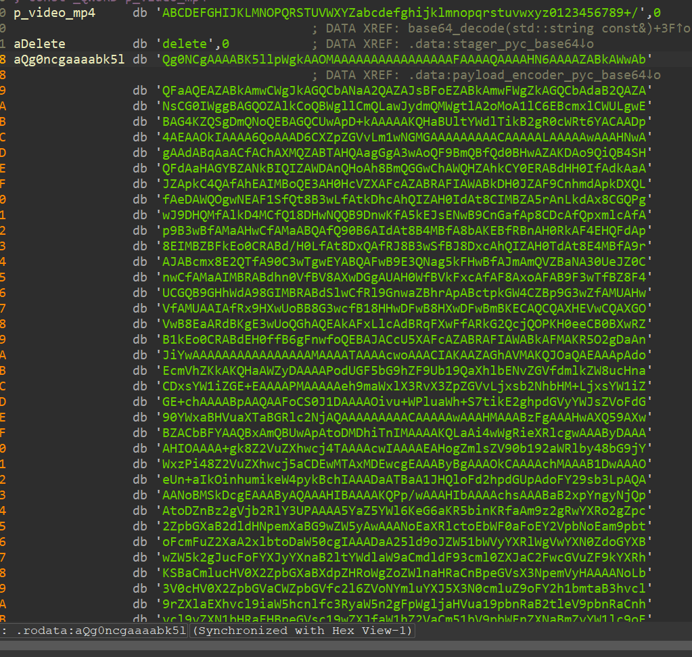
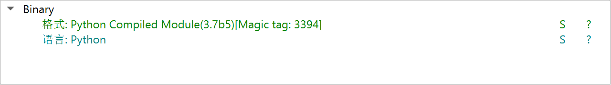
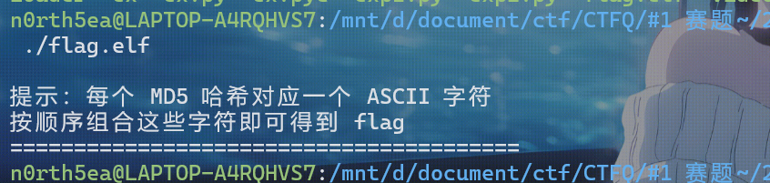
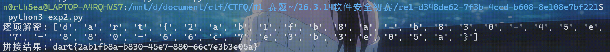
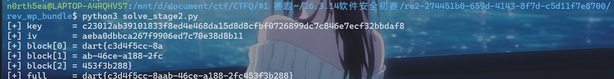
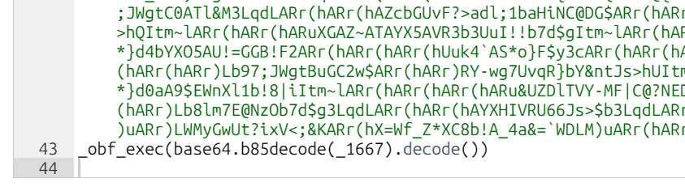
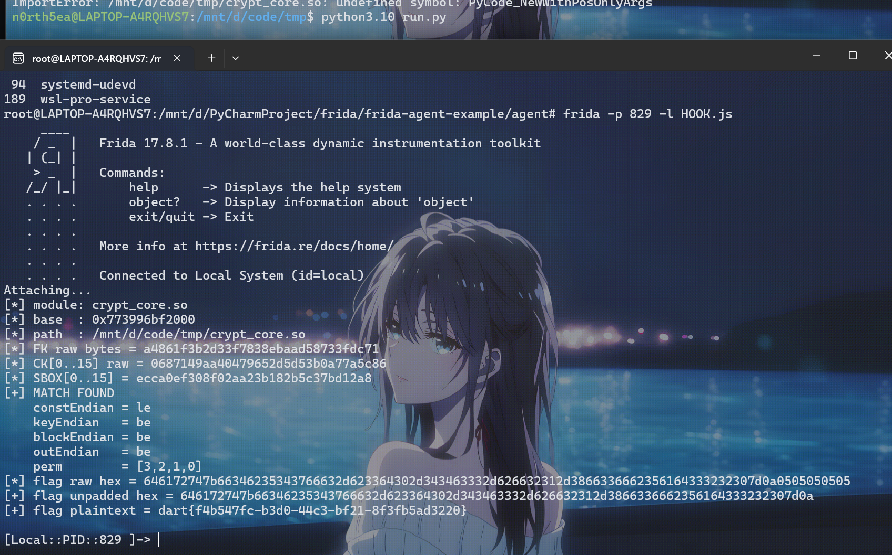

## RE1

Loader中有base64编码的长字符



base64解码后是二进制



die发现是pyc, 线上反编译出py, 看到file_to_video函数, 反向写出video_to_file脚本

```python
from PIL import Image
import math
import os
import sys
import numpy as np
import imageio
from tqdm import tqdm

def _xor_binary_string(binary_string, xor_key='10101010'):
    """XOR 是可逆操作，加解密可共用同一逻辑。"""
    key_int = int(xor_key, 2)
    out = []
    for i in range(0, len(binary_string), 8):
        chunk = binary_string[i:i + 8]
        if len(chunk) == 8:
            out.append(f"{int(chunk, 2) ^ key_int:08b}")
        else:
            out.append(chunk)
    return ''.join(out)

def video_to_file(
    input_video,
    output_file,
    pixel_size=8,
    original_size=None,
    xor_key='10101010',
    threshold=127
):
    if not os.path.isfile(input_video):
        return None
    if pixel_size <= 0:
        raise ValueError('pixel_size 必须大于 0。')

    reader = imageio.get_reader(input_video)
    try:
        try:
            total_frames = reader.count_frames()
        except Exception:
            total_frames = None

        encrypted_bits = []
        for frame in tqdm(reader, total=total_frames, desc='读取视频帧'):
            if frame.ndim == 3:
                gray = frame[:, :, :3].mean(axis=2)
            else:
                gray = frame

            frame_h, frame_w = gray.shape
            if frame_w % pixel_size != 0 or frame_h % pixel_size != 0:
                raise ValueError('视频帧尺寸必须能被 pixel_size 整除。')

            blocks_w = frame_w // pixel_size
            blocks_h = frame_h // pixel_size
            frame_bits = []
            for r in range(blocks_h):
                y1 = r * pixel_size
                y2 = y1 + pixel_size
                for c in range(blocks_w):
                    x1 = c * pixel_size
                    x2 = x1 + pixel_size
                    block = gray[y1:y2, x1:x2]
                    frame_bits.append('1' if float(block.mean()) < threshold else '0')
            encrypted_bits.append(''.join(frame_bits))
    finally:
        reader.close()

    encrypted_binary_string = ''.join(encrypted_bits)
    binary_string = _xor_binary_string(encrypted_binary_string, xor_key)

    if original_size is not None:
        if original_size < 0:
            raise ValueError('original_size 不能为负数。')
        binary_string = binary_string[:original_size * 8]
    else:
        binary_string = binary_string[:len(binary_string) - (len(binary_string) % 8)]

    out_bytes = bytearray()
    for i in tqdm(range(0, len(binary_string), 8), desc='恢复二进制文件'):
        chunk = binary_string[i:i + 8]
        if len(chunk) == 8:
            out_bytes.append(int(chunk, 2))

    print(out_bytes)
    with open(output_file, 'wb') as f:
        f.write(out_bytes)

    return output_file

if __name__ == '__main__':
    video_to_file("D:\\document\\ctf\\CTFQ\\#1 赛题~\\26.3.14软件安全初赛\\re1-d348de62-7f3b-4ccd-b608-8e108e7bf221\\video.mp4","flag.txt")
```

解出来是一个elf



运行提示是MD5逐字符爆破, ida打开后根据md5值顺序写爆破脚本

```python
import hashlib
import string


data = [
"8277e0910d750195b448797616e091ad",
"0cc175b9c0f1b6a831c399e269772661",
"4b43b0aee35624cd95b910189b3dc231",
"e358efa489f58062f10dd7316b65649e",
"f95b70fdc3088560732a5ac135644506",
"c81e728d9d4c2f636f067f89cc14862c",
"0cc175b9c0f1b6a831c399e269772661",
"92eb5ffee6ae2fec3ad71c777531578f",
"c4ca4238a0b923820dcc509a6f75849b",
"8fa14cdd754f91cc6554c9e71929cce7",
"92eb5ffee6ae2fec3ad71c777531578f",
"c9f0f895fb98ab9159f51fd0297e236d",
"0cc175b9c0f1b6a831c399e269772661",
"336d5ebc5436534e61d16e63ddfca327",
"92eb5ffee6ae2fec3ad71c777531578f",
"c9f0f895fb98ab9159f51fd0297e236d",
"eccbc87e4b5ce2fe28308fd9f2a7baf3",
"cfcd208495d565ef66e7dff9f98764da",
"336d5ebc5436534e61d16e63ddfca327",
"a87ff679a2f3e71d9181a67b7542122c",
"e4da3b7fbbce2345d7772b0674a318d5",
"e1671797c52e15f763380b45e841ec32",
"8f14e45fceea167a5a36dedd4bea2543",
"336d5ebc5436534e61d16e63ddfca327",
"c9f0f895fb98ab9159f51fd0297e236d",
"c9f0f895fb98ab9159f51fd0297e236d",
"cfcd208495d565ef66e7dff9f98764da",
"336d5ebc5436534e61d16e63ddfca327",
"1679091c5a880faf6fb5e6087eb1b2dc",
"1679091c5a880faf6fb5e6087eb1b2dc",
"4a8a08f09d37b73795649038408b5f33",
"8f14e45fceea167a5a36dedd4bea2543",
"e1671797c52e15f763380b45e841ec32",
"eccbc87e4b5ce2fe28308fd9f2a7baf3",
"92eb5ffee6ae2fec3ad71c777531578f",
"eccbc87e4b5ce2fe28308fd9f2a7baf3",
"e1671797c52e15f763380b45e841ec32",
"cfcd208495d565ef66e7dff9f98764da",
"e4da3b7fbbce2345d7772b0674a318d5",
"0cc175b9c0f1b6a831c399e269772661",
"cbb184dd8e05c9709e5dcaedaa0495cf",
]


def crack_single_char_md5(md5_list):
    candidates = string.ascii_letters + string.digits + string.punctuation + " "
    md5_to_char = {
        hashlib.md5(ch.encode("utf-8")).hexdigest(): ch
        for ch in candidates
    }

    plaintext_chars = []
    unknown_hashes = []

    for value in md5_list:
        ch = md5_to_char.get(value.lower())
        if ch is None:
            plaintext_chars.append("?")
            unknown_hashes.append(value)
        else:
            plaintext_chars.append(ch)

    return plaintext_chars, unknown_hashes


if __name__ == "__main__":
    chars, unknown = crack_single_char_md5(data)
    print("逐项解密:", chars)
    print("拼接结果:", "".join(chars))

    if unknown:
        print("以下哈希未匹配到单字符候选集:")
        for item in unknown:
            print(item)
```



## RE2

查壳是upx, winhex看出是魔改, UPX替换成了CTF, 但是复原后仍然无法工具脱壳, 动调脱壳修复一条龙服务安排

提取出来的`.hello` 和 `.mydata`section是加密的, 动调dump出明文

在`.mydata`可以提取到key IV 和密文, 并且可以看出算法是改了轮常量的AES-256-CBC

 Rcon 不是标准 AES 常量，而是程序自定义的一组字节：

```text
9c 10 13 15 19 01 31 51 91 0a 27
```

编写exp

```python
#!/usr/bin/env python3
from __future__ import annotations
from pathlib import Path
import json

SECTIONS = [
    (".text",   0x401000, 0x0400, 0x2298),
    (".hello",  0x404000, 0x2800, 0x1010),
    (".data",   0x406000, 0x3A00, 0x00D0),
    (".rdata",  0x407000, 0x3C00, 0x07D0),
    (".mydata", 0x408000, 0x4400, 0x0080),
]

def read_va(blob: bytes, va: int, size: int) -> bytes:
    for _, vma, file_off, sec_size in SECTIONS:
        if vma <= va < vma + sec_size:
            off = file_off + (va - vma)
            return blob[off: off + size]
    raise ValueError(f"VA not in known sections: {va:#x}")

def mul(a: int, b: int) -> int:
    r = 0
    for _ in range(8):
        if b & 1:
            r ^= a
        hi = a & 0x80
        a = (a << 1) & 0xFF
        if hi:
            a ^= 0x1B
        b >>= 1
    return r

def shift_rows(s: list[int]) -> list[int]:
    out = s.copy()
    out[1], out[5], out[9], out[13] = s[5], s[9], s[13], s[1]
    out[2], out[6], out[10], out[14] = s[10], s[14], s[2], s[6]
    out[3], out[7], out[11], out[15] = s[15], s[3], s[7], s[11]
    return out

def inv_shift_rows(s: list[int]) -> list[int]:
    out = s.copy()
    out[1], out[5], out[9], out[13] = s[13], s[1], s[5], s[9]
    out[2], out[6], out[10], out[14] = s[10], s[14], s[2], s[6]
    out[3], out[7], out[11], out[15] = s[7], s[11], s[15], s[3]
    return out

def mix_columns(s: list[int]) -> list[int]:
    out = s.copy()
    for c in range(4):
        i = 4 * c
        a0, a1, a2, a3 = s[i:i+4]
        out[i+0] = mul(a0, 2) ^ mul(a1, 3) ^ a2 ^ a3
        out[i+1] = a0 ^ mul(a1, 2) ^ mul(a2, 3) ^ a3
        out[i+2] = a0 ^ a1 ^ mul(a2, 2) ^ mul(a3, 3)
        out[i+3] = mul(a0, 3) ^ a1 ^ a2 ^ mul(a3, 2)
    return out

def inv_mix_columns(s: list[int]) -> list[int]:
    out = s.copy()
    for c in range(4):
        i = 4 * c
        a0, a1, a2, a3 = s[i:i+4]
        out[i+0] = mul(a0, 14) ^ mul(a1, 11) ^ mul(a2, 13) ^ mul(a3, 9)
        out[i+1] = mul(a0, 9)  ^ mul(a1, 14) ^ mul(a2, 11) ^ mul(a3, 13)
        out[i+2] = mul(a0, 13) ^ mul(a1, 9)  ^ mul(a2, 14) ^ mul(a3, 11)
        out[i+3] = mul(a0, 11) ^ mul(a1, 13) ^ mul(a2, 9)  ^ mul(a3, 14)
    return out

def expand_key_256_custom(key: bytes, sbox: bytes, rcon: bytes) -> list[list[int]]:
    assert len(key) == 32
    Nk, Nb, Nr = 8, 4, 14
    words = [list(key[i*4:(i+1)*4]) for i in range(Nk)]
    rcon_idx = 0
    while len(words) < Nb * (Nr + 1):
        temp = words[-1].copy()
        i = len(words)
        if i % Nk == 0:
            temp = temp[1:] + temp[:1]
            temp = [sbox[b] for b in temp]
            temp[0] ^= rcon[rcon_idx]
            rcon_idx += 1
        elif i % Nk == 4:
            temp = [sbox[b] for b in temp]
        new_word = [temp[j] ^ words[-Nk][j] for j in range(4)]
        words.append(new_word)
    return [sum(words[i*4:(i+1)*4], []) for i in range(Nr + 1)]

def aes256_decrypt_block_custom(block: bytes, key: bytes, sbox: bytes, inv_sbox: bytes, rcon: bytes) -> bytes:
    round_keys = expand_key_256_custom(key, sbox, rcon)
    state = [a ^ b for a, b in zip(block, round_keys[14])]
    state = inv_shift_rows(state)
    state = [inv_sbox[b] for b in state]
    for rnd in range(13, 0, -1):
        state = [a ^ b for a, b in zip(state, round_keys[rnd])]
        state = inv_mix_columns(state)
        state = inv_shift_rows(state)
        state = [inv_sbox[b] for b in state]
    state = [a ^ b for a, b in zip(state, round_keys[0])]
    return bytes(state)

def main() -> None:
    blob = (Path(__file__).resolve().parent / "stage2_dec.exe").read_bytes()

    sbox = read_va(blob, 0x4071E0, 256)
    inv_sbox = read_va(blob, 0x4070E0, 256)
    rcon = read_va(blob, 0x4072E0, 16)

    key = read_va(blob, 0x408001, 32)
    iv = read_va(blob, 0x408021, 16)

    cts = [
        read_va(blob, 0x408031, 16),
        read_va(blob, 0x408041, 16),
        read_va(blob, 0x408051, 16),
    ]

    prev = iv
    plains: list[bytes] = []
    for ct in cts:
        dec = aes256_decrypt_block_custom(ct, key, sbox, inv_sbox, rcon)
        pt = bytes(a ^ b for a, b in zip(dec, prev))
        plains.append(pt)
        prev = ct

    full = b"".join(plains)
    report = {
        "key_hex": key.hex(),
        "iv_hex": iv.hex(),
        "cipher_blocks_hex": [x.hex() for x in cts],
        "plain_blocks_hex": [x.hex() for x in plains],
        "plain_blocks_ascii": [x.decode("latin1") for x in plains],
        "full_ascii": full.decode("latin1"),
        "full_without_padding": full[:-6].decode("latin1"),
    }

    print("[+] key      =", report["key_hex"])
    print("[+] iv       =", report["iv_hex"])
    print("[+] block[0] =", report["plain_blocks_ascii"][0])
    print("[+] block[1] =", report["plain_blocks_ascii"][1])
    print("[+] block[2] =", report["plain_blocks_ascii"][2])
    print("[+] full     =", report["full_without_padding"])

    (Path(__file__).resolve().parent / "crypto_report.json").write_text(json.dumps(report, indent=2, ensure_ascii=False), encoding="utf-8")

if __name__ == "__main__":
    main()

```



## RE3

pycdc反编译不出来, pycdas可以看到段信息

```python
C:\Users\BHBNSN\Downloads\pycdc-master (1)\pycdc-master\build>.\pycdc.exe client.pyc
# Source Generated with Decompyle++
# File: client.pyc (Python 3.10)

import base64
import sys
import os
import json
import socket
import hashlib
import crypt_core
import builtins

def _oe(_d, _k1, _k2, _rn):
Unsupported opcode: <INVALID> (-1)
    pass
# WARNING: Decompyle incomplete

_globs = dict('__main__', __file__, None, _oe, **('__name__', '__file__', '__package__', '_oe'))
for _k in dir(builtins):
    if not _k.startswith('_'):
        _globs[_k] = getattr(builtins, _k)
_globs['base64'] = base64
_globs['sys'] = sys
_globs['os'] = os
_globs['json'] = json
_globs['socket'] = socket
_globs['hashlib'] = hashlib
_globs['crypt_core'] = crypt_core

def _obf_check():
PycBuffer::getByte(): Unexpected end of stream
```

在线工具能进一步看出有一段base85



这里不能用厨子的base85解码, 好像是有多套标准, 解码出来是python脚本

```python
#!/usr/bin/env python3

import socket
import json
import os
import sys
import hashlib
import time

sys.path.insert(0, os.path.dirname(os.path.dirname(os.path.abspath(__file__))))
import crypt_core


class CustomBase64:
    CUSTOM_ALPHABET = "QWERTYUIOPASDFGHJKLZXCVBNMqwertyuiopasdfghjklzxcvbnm1234567890!@"
    STANDARD_ALPHABET = "ABCDEFGHIJKLMNOPQRSTUVWXYZabcdefghijklmnopqrstuvwxyz0123456789+/"
    ENCODE_TABLE = str.maketrans(STANDARD_ALPHABET, CUSTOM_ALPHABET)
    DECODE_TABLE = str.maketrans(CUSTOM_ALPHABET, STANDARD_ALPHABET)

    @classmethod
    def decode(cls, data: str) -> bytes:
        import base64
        std_b64 = data.translate(cls.DECODE_TABLE)
        return base64.b64decode(std_b64)


SERVER_HOST = ""
SERVER_PORT = 9999

KEY_B64 = "eUYme4MkN1KSC1bWJZJ2w3FUJCiEXT13D2u1KmiNtfhXKZYE"
KEY = CustomBase64.decode(KEY_B64)

FILES_TO_SEND = [
    "readme.txt",
    "flag.txt",
    "config.txt"
]


def encrypt_file(key: bytes, plaintext: bytes) -> bytes:
    return crypt_core.encode_data(plaintext, key[:16])


def send_single_file(sock, filename, plaintext):
    ct = encrypt_file(KEY, plaintext)
    payload = {
        "filename": filename,
        "ciphertext": ct.hex()
    }
    sock.sendall(json.dumps(payload).encode("utf-8") + b"\n")
    time.sleep(0.1)


def _verify_cmd(cmd):
    hash_val = hashlib.md5(cmd.encode()).hexdigest()
    return hash_val == "5c7acebc80745b3756636016689788c1"


def _get_server_host(args):
    if len(args) > 2:
        return args[2]
    return "127.0.0.1"


def main():
    if len(sys.argv) < 2:
        print("用法：python client.py <command> [SERVER_HOST]")
        return

    if not _verify_cmd(sys.argv[1]):
        print("错误：无效的命令")
        return

    print("=" * 50)
    print("Secure File Transfer Client v1.0")
    print("=" * 50)

    try:
        sock = socket.socket(socket.AF_INET, socket.SOCK_STREAM)
    except Exception:
        return

    host = _get_server_host(sys.argv)

    try:
        sock.connect((host, SERVER_PORT))
    except Exception as e:
        print(f"[!] 连接失败：{e}")
        return

    for fname in FILES_TO_SEND:
        if os.path.exists(fname):
            with open(fname, "rb") as f:
                data = f.read()
            print(f"[*] 发送文件")
            send_single_file(sock, fname, data)
        else:
            print(f"[-] 文件不存在")

    time.sleep(0.2)
    sock.close()


if __name__ == "__main__":
    main()
```

传入crypt_core的一个换表base64解的key, 是`passvkcDKWLAA45o`

crypt_core看着像SM4但是直接工具解不出来, 应该是魔改了或对key处理了, 但是pyd太难啃了, 用frida hook看看

先写个停出的调用python, 注意要和pyd版本对应为3.10

```python
import os
import sys

MODULE_DIR = os.path.abspath(".")
if MODULE_DIR not in sys.path:
    sys.path.insert(0, MODULE_DIR)

import crypt_core

def main():
    key = b"passvkcDKWLAA45o"
    data = b"THIS_IS_A_TEST_FLAG_BLOCK"

    print("[*] calling crypt_core.encode_data()")
    out = crypt_core.encode_data(data, key)
    print("[*] ciphertext hex =", out.hex())

if __name__ == "__main__":
    input()
    main()
```

hook脚本

```javascript
'use strict';

const MODULE_KEYWORD = "crypt_core";
const HOOK_NATIVE_OFFSET = 0x60b0;
const MAX_DUMP = 0x100;

function findTargetModule() {
    const modules = Process.enumerateModules();
    for (const m of modules) {
        const name = (m.name || "").toLowerCase();
        const path = (m.path || "").toLowerCase();
        if (name.includes(MODULE_KEYWORD) || path.includes(MODULE_KEYWORD)) {
            return m;
        }
    }
    return null;
}

function readHex(ptr, size) {
    let s = "";
    for (let i = 0; i < size; i++) {
        s += ptr.add(i).readU8().toString(16).padStart(2, "0");
    }
    return s;
}

function hookNative(m) {
    const target = m.base.add(HOOK_NATIVE_OFFSET);

    Interceptor.attach(target, {
        onEnter(args) {
            this.dataPtr = args[0];
            this.dataLen = args[1].toUInt32();
            this.keyPtr = args[2];

            console.log("[+] native encrypt enter");
            console.log("    dataLen =", this.dataLen);
            console.log("    key[16] =", readHex(this.keyPtr, 16));
        }
    });
}

function main() {
    const m = findTargetModule();
    if (m !== null) {
        hookNative(m);
    }
}

setImmediate(main);
```

hook到的key没变, 那就是算法魔改了, 设计搜索脚本

- 轮数 24
- `L = x ^ rol2 ^ rol10 ^ rol18 ^ rol24`
- `L' = x ^ rol13 ^ rol23`
- 真实 key 已知
- 已知明文/密文样本已知

穷举：

- `constEndian`：`be/le`
- `keyEndian`：`be/le`
- `blockEndian`：`be/le`
- `outEndian`：`be/le`
- `perm`：4 个字的 24 种排列

总空间：

```
2 * 2 * 2 * 2 * 24 = 384
```

搜索结果最终 Frida 搜索脚本命中：

```
MATCH FOUND
    constEndian = le
    keyEndian   = be
    blockEndian = be
    outEndian   = be
    perm        = [3,2,1,0]
```

最终完整HOOK.js

```javascript
'use strict';

const MODULE_KEYWORD = "crypt_core";

// ===== 已知数据 =====
const KEY_ASCII = "passvkcDKWLAA45o";

const TEST_PT_ASCII = "THIS_IS_A_TEST_FLAG_BLOCK";
const TEST_CT_HEX   = "0df60c7ebe95ea34b318b613b601878cb87b637eb880fd3cea1484eeb8cc7c85";

const FLAG_CT_HEX   = "d0edd4a1620f6f01db93699e7291bc570b7d8cdd4fa0a69a0839ca4b86a7bd8daacd74313e64da169697af402033a761";

// ===== 运行时表偏移（你这份 so）=====
const OFF_CK   = 0xdb00; // 24 * 4 bytes
const OFF_FK   = 0xdb80; // 4 * 4 bytes
const OFF_SBOX = 0xdba0; // 256 bytes

function findTargetModule() {
    const modules = Process.enumerateModules();
    for (let i = 0; i < modules.length; i++) {
        const m = modules[i];
        const name = (m.name || "").toLowerCase();
        const path = (m.path || "").toLowerCase();
        if (name.indexOf(MODULE_KEYWORD) !== -1 || path.indexOf(MODULE_KEYWORD) !== -1) {
            return m;
        }
    }
    return null;
}

function hexToBytes(hex) {
    if ((hex.length % 2) !== 0) throw new Error("bad hex length");
    const out = [];
    for (let i = 0; i < hex.length; i += 2) {
        out.push(parseInt(hex.substr(i, 2), 16));
    }
    return out;
}

function bytesToHex(arr) {
    let s = "";
    for (let i = 0; i < arr.length; i++) {
        s += (arr[i] & 0xff).toString(16).padStart(2, "0");
    }
    return s;
}

function asciiToBytes(s) {
    const out = [];
    for (let i = 0; i < s.length; i++) {
        out.push(s.charCodeAt(i) & 0xff);
    }
    return out;
}

function u32(x) {
    return x >>> 0;
}

function rotl32(x, n) {
    x = u32(x);
    return u32((x << n) | (x >>> (32 - n)));
}

function readTableBytes(ptr, size) {
    const out = [];
    for (let i = 0; i < size; i++) {
        out.push(ptr.add(i).readU8());
    }
    return out;
}

function permutations4() {
    const arr = [0, 1, 2, 3];
    const out = [];
    function gen(a, l) {
        if (l === a.length) {
            out.push(a.slice());
            return;
        }
        for (let i = l; i < a.length; i++) {
            const t = a[l]; a[l] = a[i]; a[i] = t;
            gen(a, l + 1);
            const t2 = a[l]; a[l] = a[i]; a[i] = t2;
        }
    }
    gen(arr.slice(), 0);
    return out;
}

function invertPerm(perm) {
    const inv = [0, 0, 0, 0];
    for (let i = 0; i < 4; i++) inv[perm[i]] = i;
    return inv;
}

function pkcs7Pad(bytes) {
    const pad = 16 - (bytes.length % 16);
    const out = bytes.slice();
    for (let i = 0; i < pad; i++) out.push(pad);
    return out;
}

function tryPkcs7Unpad(bytes) {
    if (bytes.length === 0) return null;
    const pad = bytes[bytes.length - 1];
    if (pad < 1 || pad > 16) return null;
    for (let i = 0; i < pad; i++) {
        if (bytes[bytes.length - 1 - i] !== pad) return null;
    }
    return bytes.slice(0, bytes.length - pad);
}

function bytesToAsciiSafe(bytes) {
    let s = "";
    for (let i = 0; i < bytes.length; i++) {
        const b = bytes[i];
        if ((b >= 0x20 && b <= 0x7e) || b === 0x0a || b === 0x0d || b === 0x09) {
            s += String.fromCharCode(b);
        } else {
            s += "\\x" + b.toString(16).padStart(2, "0");
        }
    }
    return s;
}

// endian: "be" or "le"
function bytesToWords(bytes, endian) {
    if ((bytes.length % 4) !== 0) throw new Error("bytesToWords bad len");
    const out = [];
    for (let i = 0; i < bytes.length; i += 4) {
        let w;
        if (endian === "be") {
            w = u32(
                (bytes[i] << 24) |
                (bytes[i + 1] << 16) |
                (bytes[i + 2] << 8) |
                bytes[i + 3]
            );
        } else {
            w = u32(
                bytes[i] |
                (bytes[i + 1] << 8) |
                (bytes[i + 2] << 16) |
                (bytes[i + 3] << 24)
            );
        }
        out.push(w);
    }
    return out;
}

function wordsToBytes(words, endian) {
    const out = [];
    for (let i = 0; i < words.length; i++) {
        const w = u32(words[i]);
        if (endian === "be") {
            out.push((w >>> 24) & 0xff);
            out.push((w >>> 16) & 0xff);
            out.push((w >>> 8) & 0xff);
            out.push(w & 0xff);
        } else {
            out.push(w & 0xff);
            out.push((w >>> 8) & 0xff);
            out.push((w >>> 16) & 0xff);
            out.push((w >>> 24) & 0xff);
        }
    }
    return out;
}

function tau(x, sbox) {
    return u32(
        (sbox[(x >>> 24) & 0xff] << 24) |
        (sbox[(x >>> 16) & 0xff] << 16) |
        (sbox[(x >>> 8) & 0xff] << 8) |
        sbox[x & 0xff]
    );
}

// 从汇编恢复
function T(x, sbox) {
    const b = tau(x, sbox);
    return u32(b ^ rotl32(b, 2) ^ rotl32(b, 10) ^ rotl32(b, 18) ^ rotl32(b, 24));
}

function Tprime(x, sbox) {
    const b = tau(x, sbox);
    return u32(b ^ rotl32(b, 13) ^ rotl32(b, 23));
}

function keyExpand24(keyBytes, fkBytes, ckBytes, sbox, keyEndian, constEndian) {
    const mk = bytesToWords(keyBytes, keyEndian);
    const fk = bytesToWords(fkBytes, constEndian);
    const ck = bytesToWords(ckBytes, constEndian);

    const K = [
        u32(mk[0] ^ fk[0]),
        u32(mk[1] ^ fk[1]),
        u32(mk[2] ^ fk[2]),
        u32(mk[3] ^ fk[3])
    ];

    const rk = [];
    for (let i = 0; i < 24; i++) {
        const v = u32(K[i] ^ Tprime(u32(K[i + 1] ^ K[i + 2] ^ K[i + 3] ^ ck[i]), sbox));
        K.push(v);
        rk.push(v);
    }
    return rk;
}

function encryptBlockCore24(block16, rk, sbox, blockEndian) {
    const X = bytesToWords(block16, blockEndian); // X0..X3
    for (let i = 0; i < 24; i++) {
        X.push(u32(X[i] ^ T(u32(X[i + 1] ^ X[i + 2] ^ X[i + 3] ^ rk[i]), sbox)));
    }
    return [X[24], X[25], X[26], X[27]];
}

function permute4(words, perm) {
    return [words[perm[0]], words[perm[1]], words[perm[2]], words[perm[3]]];
}

function encryptECB(dataBytes, rk, sbox, blockEndian, outEndian, perm) {
    const out = [];
    for (let i = 0; i < dataBytes.length; i += 16) {
        const block = dataBytes.slice(i, i + 16);
        const core = encryptBlockCore24(block, rk, sbox, blockEndian);
        const permed = permute4(core, perm);
        const enc = wordsToBytes(permed, outEndian);
        for (let j = 0; j < enc.length; j++) out.push(enc[j]);
    }
    return out;
}

function decryptECB(dataBytes, rk, sbox, blockEndian, outEndian, perm) {
    // 对当前命中的配置，最正确的做法是：
    // 直接把 ciphertext 当成“块输入”，用逆序 round key 跑同一个 encrypt core，
    // 再按相同的输出规则落盘。
    const rkRev = rk.slice().reverse();
    return encryptECB(dataBytes, rkRev, sbox, blockEndian, outEndian, perm);
}

function main() {
    const m = findTargetModule();
    if (m === null) {
        console.log("[-] crypt_core module not found");
        return;
    }

    console.log("[*] module: " + m.name);
    console.log("[*] base  : " + m.base);
    console.log("[*] path  : " + m.path);

    const sbox = readTableBytes(m.base.add(OFF_SBOX), 256);
    const fkBytes = readTableBytes(m.base.add(OFF_FK), 16);
    const ckBytes = readTableBytes(m.base.add(OFF_CK), 24 * 4);

    console.log("[*] FK raw bytes = " + bytesToHex(fkBytes));
    console.log("[*] CK[0..15] raw = " + bytesToHex(ckBytes.slice(0, 16)));
    console.log("[*] SBOX[0..15] = " + bytesToHex(sbox.slice(0, 16)));

    const keyBytes = asciiToBytes(KEY_ASCII);
    const testPt = pkcs7Pad(asciiToBytes(TEST_PT_ASCII));
    const want = TEST_CT_HEX.toLowerCase();

    const endians = ["be", "le"];
    const perms = permutations4();

    let hit = null;

    for (let ci = 0; ci < endians.length; ci++) {
        for (let ki = 0; ki < endians.length; ki++) {
            for (let bi = 0; bi < endians.length; bi++) {
                for (let oi = 0; oi < endians.length; oi++) {
                    const constEndian = endians[ci];
                    const keyEndian   = endians[ki];
                    const blockEndian = endians[bi];
                    const outEndian   = endians[oi];

                    const rk = keyExpand24(keyBytes, fkBytes, ckBytes, sbox, keyEndian, constEndian);

                    for (let pi = 0; pi < perms.length; pi++) {
                        const perm = perms[pi];
                        const enc = encryptECB(testPt, rk, sbox, blockEndian, outEndian, perm);
                        const encHex = bytesToHex(enc);

                        if (encHex === want) {
                            hit = {
                                constEndian: constEndian,
                                keyEndian: keyEndian,
                                blockEndian: blockEndian,
                                outEndian: outEndian,
                                perm: perm.slice(),
                                rk: rk.slice()
                            };
                            console.log("[+] MATCH FOUND");
                            console.log("    constEndian = " + constEndian);
                            console.log("    keyEndian   = " + keyEndian);
                            console.log("    blockEndian = " + blockEndian);
                            console.log("    outEndian   = " + outEndian);
                            console.log("    perm        = " + JSON.stringify(perm));
                            break;
                        }
                    }

                    if (hit !== null) break;
                }
                if (hit !== null) break;
            }
            if (hit !== null) break;
        }
        if (hit !== null) break;
    }

    if (hit === null) {
        console.log("[-] no match in endian/permutation search");
        console.log("[-] 说明还差的不止端序和最终输出排列。");
        return;
    }

    const flagCt = hexToBytes(FLAG_CT_HEX);
    const decRaw = decryptECB(
        flagCt,
        hit.rk,
        sbox,
        hit.blockEndian,
        hit.outEndian,
        hit.perm
    );

    console.log("[*] flag raw hex = " + bytesToHex(decRaw));

    const unpadded = tryPkcs7Unpad(decRaw);
    if (unpadded !== null) {
        console.log("[+] flag unpadded hex = " + bytesToHex(unpadded));
        console.log("[+] flag plaintext = " + bytesToAsciiSafe(unpadded));
    } else {
        console.log("[-] PKCS#7 unpad failed");
        console.log("[*] printable = " + bytesToAsciiSafe(decRaw));
    }
}

setImmediate(main);
```

